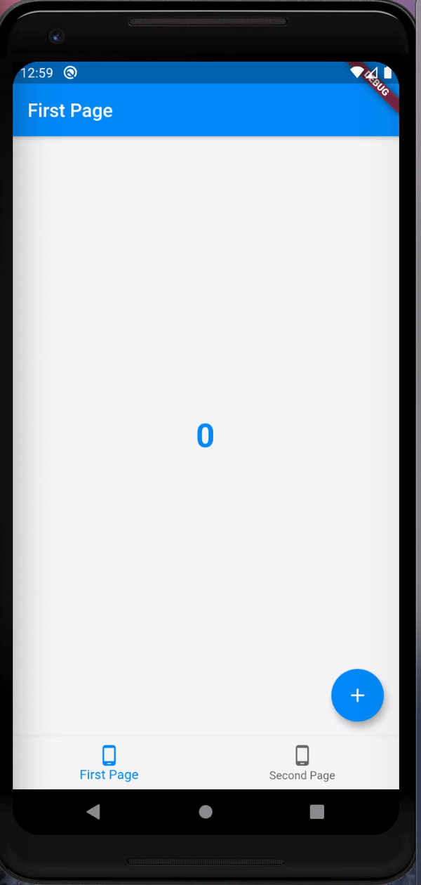

## State Management With Bottom Navigation Bar

We all have used Bottom Navigation Bars in our project , but sometimes we overlook state management. By state management i mean having a persistent state during a transition to other pages using the bottom bar.
So when you get back to the initial page , the screen will be as it was when you left.

To make things clear heres a small gif on how the app works.

Here , as you can see , we have successfully maintained the state of the variable counter during the tranisition to the other page.

The two pages can be two different screens with even different scaffolds !!